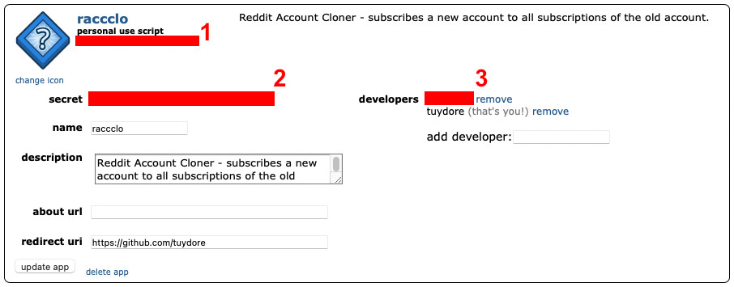

# RACCCLO
Copy subreddits and multireddits from one account to another!

## Requirements

* Python 3.10 (because I like the new type hints)
* the "requests" library, you can install that using `pip install requests`
* your old and new Reddit accounts
* creating a Reddit app
    1. navigate to User Settings > Safety & Privacy > Manage third-party app authorization
    2. create another app...
    3. make note of the CLIENT ID and SECRET TOKEN
    4. (optional, not sure this is really needed) add your other account as a developer




## Instructions

```txt
usage: RACCCLO [-h] [--config CONFIG] [--terminal]

Copy subreddits and multireddits from one account to another.

optional arguments:
  -h, --help       show this help message and exit
  --config CONFIG  Path to JSON configuration file.
  --terminal       Input credentials from the terminal.
```

Example JSON file below. **PLEASE DO NOT FORGET TO DELETE IT AFTERWARDS!**

```json
{
    "client_id": "$CLIENT_ID",
    "secret_token": "$SECRET_TOKEN",
    "src_username": "$SOURCE_USERNAME",
    "src_password": "$SOURCE_PASSWORD",
    "dst_username": "$DESTINATION_USERNAME",
    "dst_password": "$DESTINATION_PASSWORD"
}
```